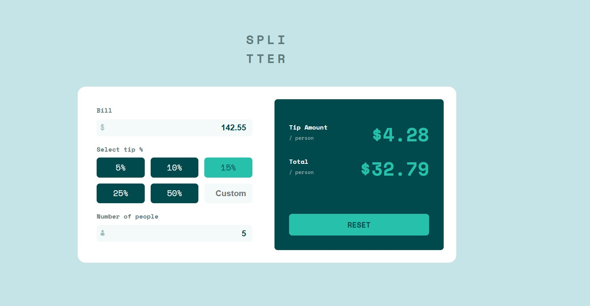

# Frontend Mentor - Tip calculator app solution

This is a solution to the [Tip calculator app challenge on Frontend Mentor](https://www.frontendmentor.io/challenges/tip-calculator-app-ugJNGbJUX). Frontend Mentor challenges help you improve your coding skills by building realistic projects.

### The challenge

Users should be able to:

- View the optimal layout for the app depending on their device's screen size
- See hover states for all interactive elements on the page
- Calculate the correct tip and total cost of the bill per person

### Screenshot



### Links

- Solution URL: [https://github.com/Gwynbleidd222/tip-calculator-app]
- Live Site URL: [https://gwynbleidd222.github.io/tip-calculator-app/]

## My process

### Built with

- Semantic HTML5 markup
- CSS custom properties
- Flexbox
- CSS Grid
- Mobile-first workflow


### What I learned

```js
const newPrice = parseFloat(price.value)
const newPeople = parseInt(people.value)
```


### Continued development


### Useful resources

https://developer.mozilla.org/en-US/docs/Web/JavaScript/Reference/Global_Objects/parseFloat
https://developer.mozilla.org/en-US/docs/Web/JavaScript/Reference/Global_Objects/parseInt

## Author

- Website - [Piotr Łojas](https://gwynbleidd222.github.io/Main-Single-Page-Portfolio/)
- Frontend Mentor - [Gwynbleidd222](https://www.frontendmentor.io/profile/Gwynbleidd222)